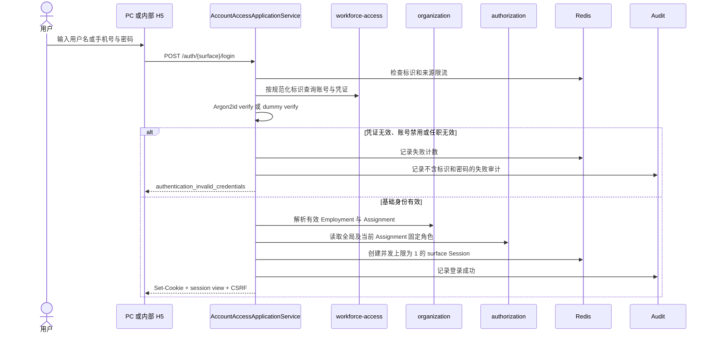
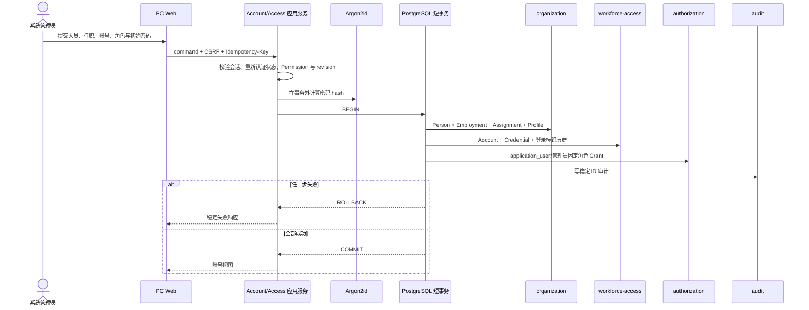

# 认证与账号链路整理

- 状态：与 ADR-0034 和当前实现一致
- 日期：2026-08-04

## 事实与边界

已知事实：当前只服务 PC Web 与内部 Taro H5；账号、组织、授权分别持有自己的表；API 应用层是唯一协调者；浏览器只持有 HttpOnly 不透明 Session。

允许假设：第一版只支持用户名或手机号加密码，本地环境可从空库 bootstrap 唯一系统管理员。

禁止假设：不存在 MFA、自助找回、外部用户、邀请、第三方登录、非浏览器客户端或可迁移的旧身份数据。

非目标：不定义 CRM 领域对象、审批、数据范围规则或未来 JWT 实现。

## 登录时序

## 创建账号时序

管理员入口保持为 `POST /workforce-administration/commands`。密码 hash 在事务外计算；成功重放不再次处理密码；失败重试必须使用新的 `Idempotency-Key`。

## 受保护请求

API 先解析 surface Cookie，再核对账号状态和 `securityRevision`，随后以 `workforcePersonId` 解析当前有效组织上下文，最后用全局角色与当前 Assignment 角色的并集请求统一 `allow/deny`。任何一步缺失或依赖不可用都失败关闭；其他 Assignment 的角色绝不参与当前请求。

## 修改与排障原则

认证入口不得再次分裂出第二套 service。排障沿固定顺序检查：HTTP surface 与 Cookie、CSRF、Redis Session、账号 revision、Employment/Assignment、固定角色、Permission 决策、审计。日志只记录稳定技术引用和安全错误码，不记录密码、hash、Cookie、登录标识、手机号或请求体。
